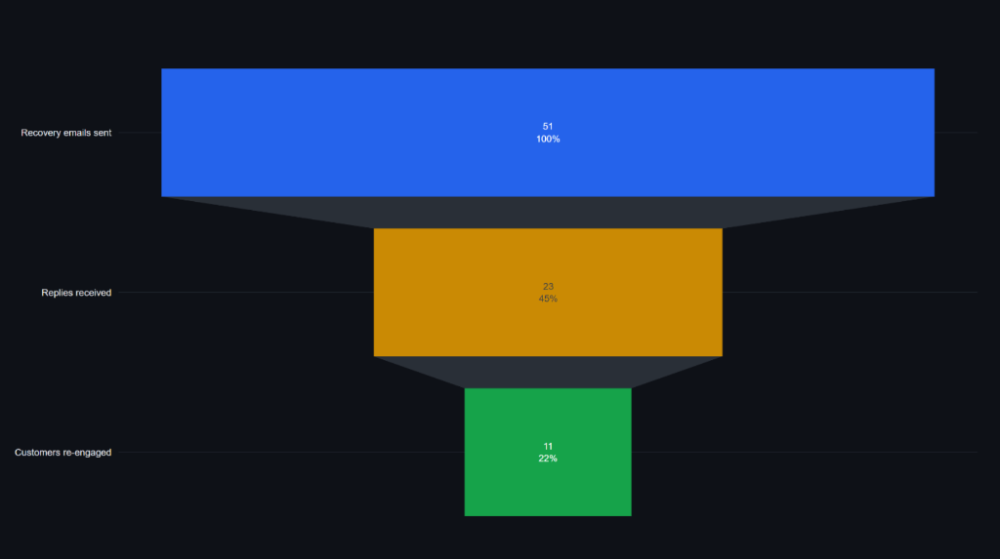
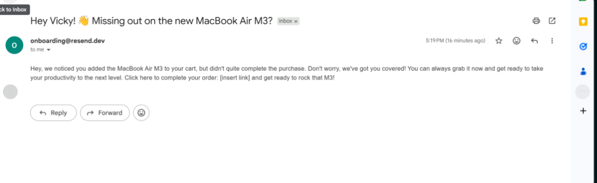
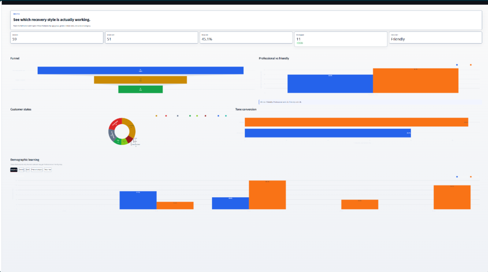
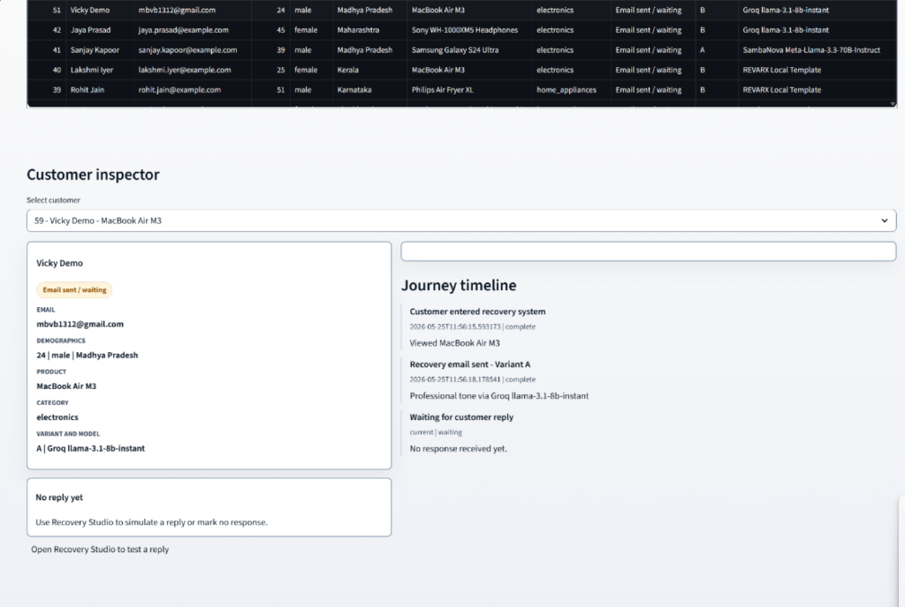
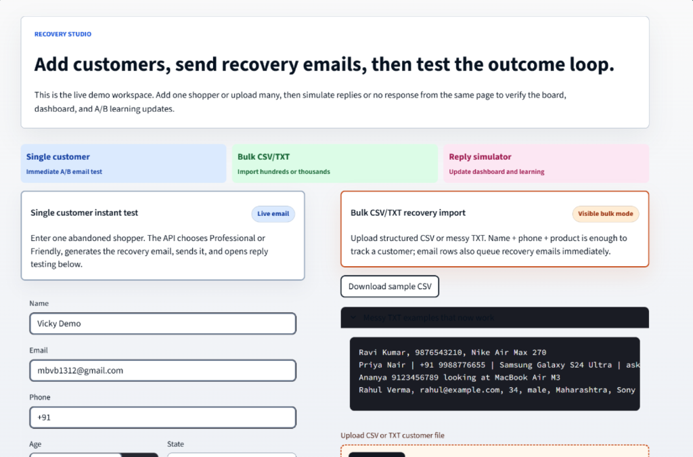

# REVARX AI — Abandoned Cart Recovery, Powered by AI

> **Turn browsed-and-bounced into bought.**  
> REVARX AI automatically follows up with abandoned shoppers, A/B tests professional vs. friendly tones, tracks replies, and learns which style converts — by age, gender, state, and product category.

---

## 🎬 See It In Action

### Recovery Funnel
> 51 emails sent → 23 replies (45%) → 11 customers re-engaged (22%)



---

### Live Recovery Email — Delivered to Real Inbox
> Personalized by product, name, and AI-chosen tone — sent via Resend in under 2 seconds.



---

### Analytics Dashboard
> A/B learning by demographic slice — see exactly which tone wins for which segment.



---

### Customer Inspector + Journey Timeline
> Every customer has a full timeline: when they entered, which email was sent, which LLM wrote it, and what happened next.



---

### Recovery Studio
> Add one shopper manually or upload hundreds via CSV/TXT. Simulate replies to update the A/B learning loop in real time.



---

## 🧠 What Problem This Solves

Every e-commerce business pays to bring customers in. When someone views a laptop, adds headphones to cart, or clicks through an ad — and then disappears — that's lost revenue the business already paid for.

**REVARX AI turns that cold intent into a warm conversation:**

1. Customer is added (manually or via bulk upload)
2. AI writes a personalized recovery message
3. System picks the best A/B tone (professional or friendly) based on past outcomes for similar customers
4. Message is sent and tracked
5. Replies are classified (hot / warm / cold / unsubscribe)
6. Analytics update — and the model gets smarter

---

## 🏗️ Architecture

```
┌─────────────────────────────────────────────────────────┐
│                   Streamlit Frontend                     │
│   Recovery Studio │ Dashboard │ Leads Board │ Analytics  │
└───────────────────────┬─────────────────────────────────┘
                        │ HTTP
┌───────────────────────▼─────────────────────────────────┐
│                    FastAPI Backend                       │
│   /leads  /upload-leads  /simulate-reply  /analytics     │
└──────┬────────────────────┬────────────────────┬────────┘
       │                    │                    │
  ┌────▼────┐         ┌─────▼─────┐       ┌─────▼──────┐
  │  SQLite  │         │ LLM Stack │       │   Resend   │
  │  leads.db│         │ Groq      │       │  (Email)   │
  │          │         │ SambaNova │       └────────────┘
  └──────────┘         │ Gemini    │
                       │ Templates │
                       └───────────┘
```

| Layer      | Technology                                      |
|------------|-------------------------------------------------|
| Frontend   | Streamlit (multi-page)                          |
| Backend    | FastAPI + APScheduler                           |
| Database   | SQLite                                          |
| Email      | Resend API                                      |
| AI (primary) | Groq (llama-3.1-8b-instant)                   |
| AI (fallback) | SambaNova → Gemini → Local Templates         |

---

## 🤖 A/B Learning Logic

| Variant | Tone        | Description                              |
|---------|-------------|------------------------------------------|
| A       | Professional | Formal marketplace language             |
| B       | Friendly     | Casual, warm, conversational            |

The recommender uses **weighted historical outcomes** for customers with matching demographics:

- **Age group** · **Gender** · **Indian state** · **Product category**

| Reply Type    | Weight   |
|---------------|----------|
| Hot reply     | Strong + |
| Warm reply    | +        |
| Cold reply    | Weak +   |
| Unsubscribe   | −        |
| No response   | 0 (lowers average) |

---

## 🚀 Quick Start

### 1. Clone & install

```bash
git clone https://github.com/mbvb1312/REVARX.git
cd REVARX
python -m venv venv
venv\Scripts\activate       # Windows
# source venv/bin/activate  # Mac/Linux
pip install -r requirements.txt
```

### 2. Configure environment

Copy `.env.example` to `.env` and fill in your keys:

```env
GROQ_API_KEY=your_groq_key
SAMBANOVA_API_KEY=your_sambanova_key
GEMINI_API_KEY=optional_gemini_key
RESEND_API_KEY=your_resend_key
FROM_EMAIL=your_verified_resend_sender
TELEGRAM_BOT_TOKEN=your_telegram_bot_token
TELEGRAM_BOT_USERNAME=your_telegram_bot_username
WHATSAPP_BUSINESS_NUMBER=your_whatsapp_business_number
DATABASE_URL=sqlite:///./leads.db
```

> **No keys?** The app falls back to local templates automatically — the demo still works.

### 3. Seed demo data (optional but recommended)

```bash
python seed_data.py
```

Creates 50 realistic Indian e-commerce customers with demographics, recovery emails, replies, and A/B outcomes pre-loaded.

### 4. Run

```bash
# Terminal 1 — Backend
uvicorn main:app --reload --port 8000

# Terminal 2 — Frontend
streamlit run frontend/app.py
```

Open **http://localhost:8501** in your browser.

---

## 📂 Project Structure

```
REVARX/
├── main.py                  # FastAPI app entry point
├── requirements.txt
├── seed_data.py             # Demo data seeder
├── .env.example
│
├── agent_core/              # A/B recommender & LLM chain
├── analytics/               # Analytics endpoints
├── backend/                 # Lead intake & CSV parser
├── channels/                # Email (Resend), WhatsApp, Telegram
│
├── frontend/
│   ├── app.py               # Streamlit entry
│   ├── components/          # Shared charts & UI components
│   └── pages/
│       ├── 02_campaign.py   # Recovery Studio
│       ├── 03_dashboard.py  # Analytics dashboard
│       └── 04_leads.py      # Customer board & inspector
│
└── docs/
    └── screenshots/         # README images
```

---

## 📡 API Reference

| Method | Endpoint                        | Description                              |
|--------|---------------------------------|------------------------------------------|
| POST   | `/leads`                        | Add one customer, trigger recovery email |
| POST   | `/upload-leads`                 | Bulk CSV/TXT upload                      |
| GET    | `/leads`                        | Live customer board                      |
| GET    | `/leads/{id}/timeline`          | Per-customer journey timeline            |
| POST   | `/simulate-reply`               | Classify reply, update A/B learning      |
| POST   | `/leads/{id}/mark-no-response`  | Mark no response                         |
| GET    | `/analytics/demographics`       | Demographic breakdown                    |
| GET    | `/analytics/ab-by-demographics` | A/B winner by demographic slice          |

---

## 📋 CSV / TXT Upload Format

**CSV (recommended columns):**
```
name,email,age,gender,state,product_viewed,product_category,notes
```

**TXT (flexible, AI-parsed):**
```
Priya Nair, priya@example.com, 28, female, Kerala, Nike Air Max 270, footwear, Viewed 3 times
Rahul Verma, rahul@example.com, Samsung Galaxy S24 Ultra, Added to cart
```

---

## 🔮 Roadmap

- [x] Email recovery via Resend
- [x] A/B tone learning by demographics
- [x] Bulk CSV/TXT upload
- [x] Per-customer journey timeline
- [x] Reply simulation & classifier
- [ ] WhatsApp channel (opt-in flow)
- [ ] Telegram bot integration
- [ ] Shopify webhook connector
- [ ] Scheduled follow-up sequences

---

## 📄 License

MIT — use freely, build on top, give credit where it's due.
